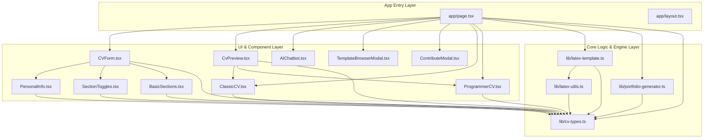

# Module Dependency Graph Baseline

## Architecture Overview
The module architecture of **Presume** was extracted using `madge` with TypeScript AST resolution (`tsconfig.json`). Presume follows a modular Next.js App Router architecture with strict unidirectional flow: top-level page controllers orchestrate interactive form sub-components, real-time template renderers, and LaTeX transformation engines.

- **Total Module Files Scanned**: 15 key TypeScript/TSX modules
- **Circular Dependencies**: 0 (Clean Directed Acyclic Graph)
- **Central Data Contract**: `lib/cv-types.ts` is the root data model consumed by 80% of application modules.

[SCREENSHOT: Madge visual dependency graph representation or interactive dependency visualization]

---

## Architectural Dependency Diagram (Mermaid)

---

## Structural Metrics & Coupling Analysis

| Module | In-Degree (Fan-In) | Out-Degree (Fan-Out) | Coupling Classification | Role in Architecture |
| :--- | :--- | :--- | :--- | :--- |
| `lib/cv-types.ts` | 10 | 0 | Pure Stable Abstraction | Canonical schema for resume state, preset templates, section models |
| `lib/latex-utils.ts` | 1 | 1 | Utility Engine | Character escaping, tabular tabularx builders, list formatters |
| `lib/latex-template.ts` | 1 | 2 | Code Generation Service | Compiles JSON CVData into compilable TeX source code |
| `components/CVForm/CVForm.tsx` | 1 | 4 | Sub-System Coordinator | Manages form sections and dispatch actions |
| `components/CvPreview.tsx` | 1 | 3 | View Synchronizer | Toggles visual DOM rendering and raw LaTeX editor views |
| `app/page.tsx` | 0 | 10 | High-Level Orchestrator | Root client component holding root state and global action handlers |
