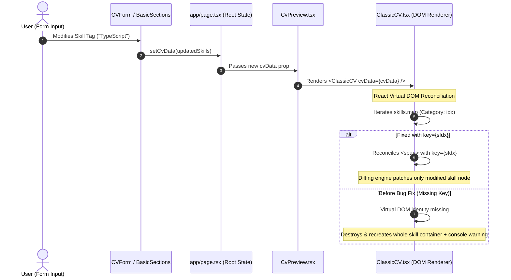
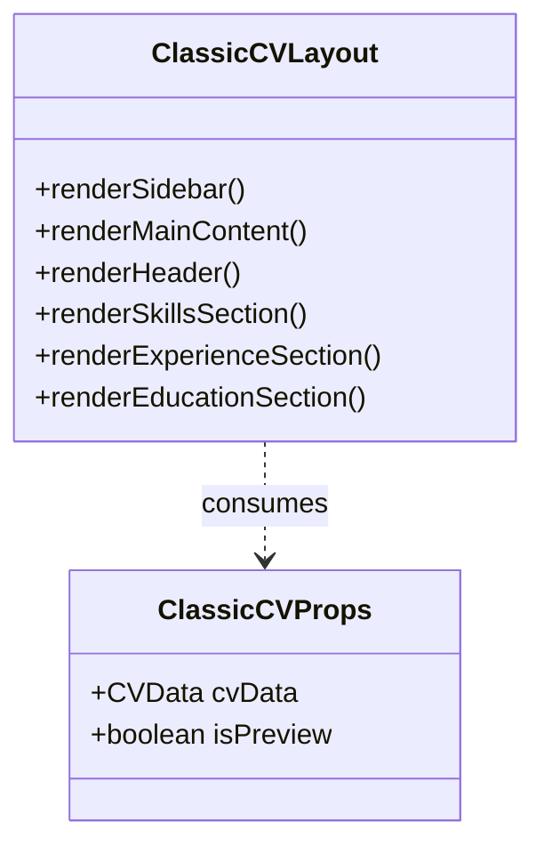

# Reverse Engineering — Corrective Maintenance

## Recovered Component Behavior & Data Flow
Reverse engineering of `ClassicCV.tsx` reveals the two-column document layout architecture and the React component lifecycle flow during state synchronization.

---

## Component Architecture & Rendering Flow (Mermaid)

---

## Recovered Control & DOM Structure

- **Sidebar Composition**: Left 33% column (`w-[33%]`) rendering Contact Details, Skill Badges, Languages, and References.
- **Main Column Composition**: Right 67% column (`w-[67%]`) rendering Summary, Work Experience, Projects, and Education.
- **Color Theming Strategy**: Dynamic inline styling derived from `cvData.themeColor` (Black `#18181b` vs Blue `#1e40af`) computing `tagBg`, `tagBorder`, and `tagText`.
