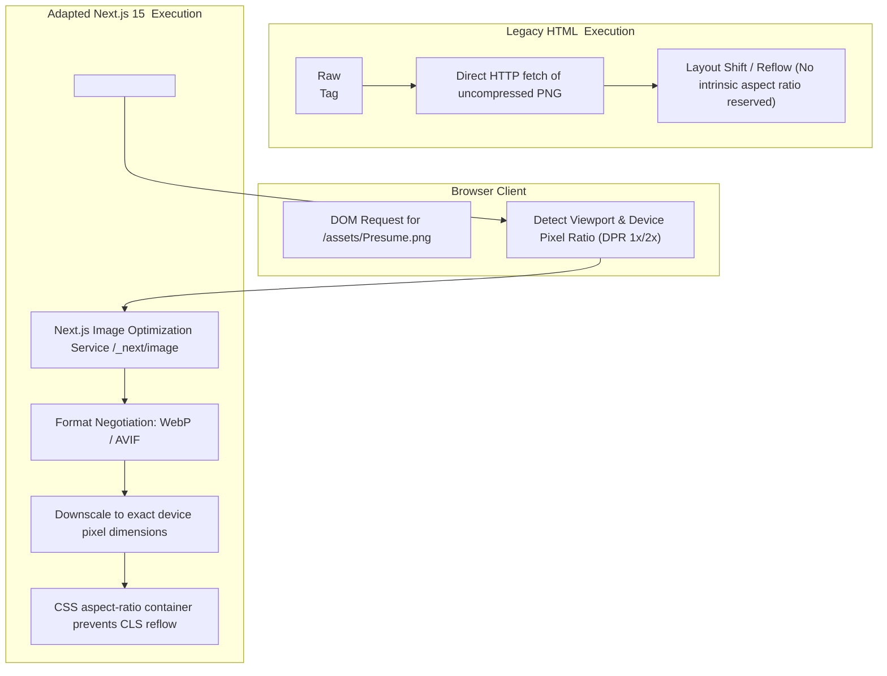

# Reverse Engineering — Adaptive Maintenance

## Recovered Next.js Image Optimization Pipeline
Reverse engineering of the Next.js 15 Image Optimization lifecycle clarifies how the adapted `<Image />` component interacts with Next.js build-time and run-time optimization services compared to legacy ``.

---

## Image Asset Optimization Pipeline (Mermaid)

---

## Recovered Architectural Constraints

1. **Aspect Ratio Preservation**: Explicit `width` and `height` parameters allow the browser's layout engine to compute aspect ratio before binary image payloads arrive over the network, guaranteeing zero Cumulative Layout Shift (CLS).
2. **Preload Priority**: Adding `priority` to the `Loader` image instructs Next.js to inject `<link rel="preload">` in the document head for immediate discovery during initial page load.
