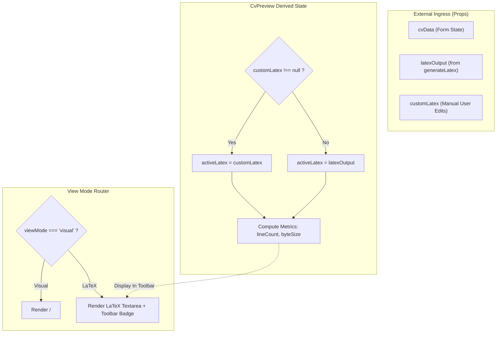
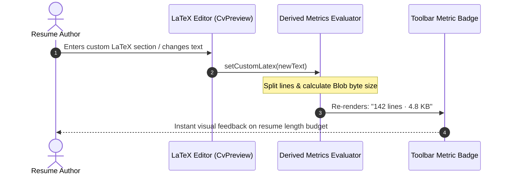

# Reverse Engineering — Perfective Maintenance

## Recovered Component State & Derivation Flow
Reverse engineering of `CvPreview.tsx` illustrates the synchronization between external generated LaTeX (`latexOutput`) and internal manual edits (`customLatex`), along with the new real-time telemetry pipeline.

---

## State Synchronizer & Derivation Architecture (Mermaid)

---

## User Interaction & Dynamic Telemetry Cycle

