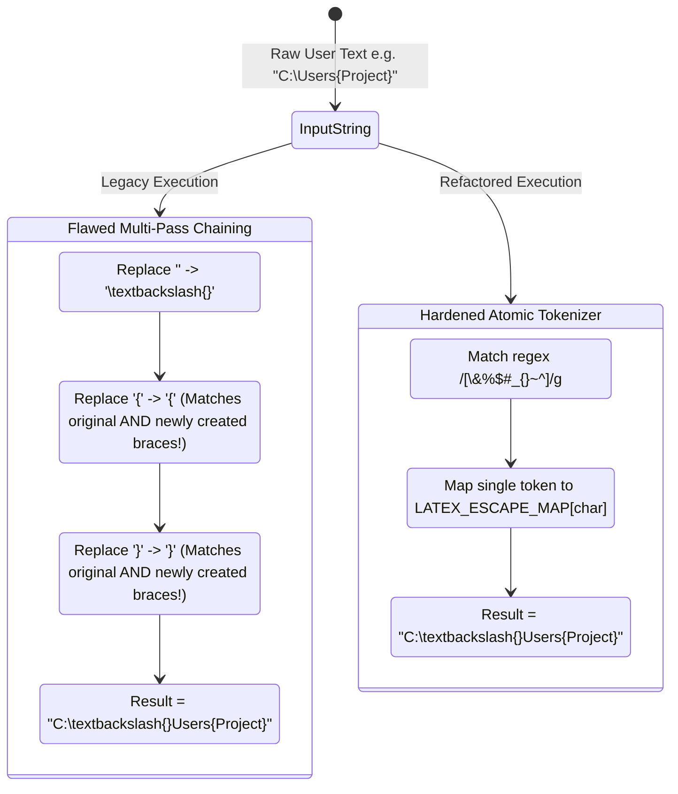
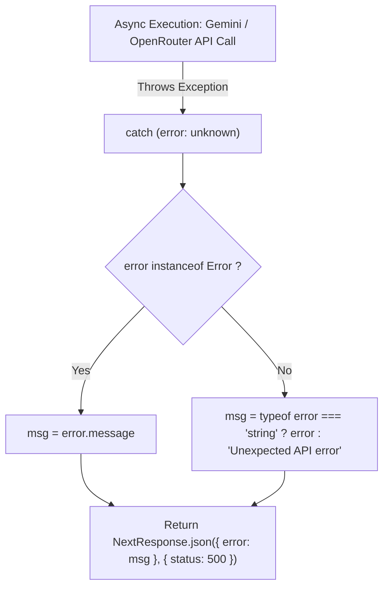

# Reverse Engineering — Preventive Maintenance

## Recovered String Tokenization & Escaping Pipeline
Reverse engineering of the LaTeX string sanitization logic demonstrates why single-pass deterministic token mapping avoids unintended cascading transformations.

---

## State Transition Diagram: Multi-Pass vs Single-Pass (Mermaid)

---

## Recovered Exception Handling Model

